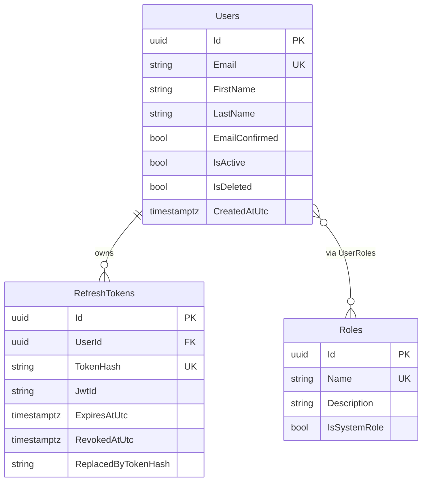
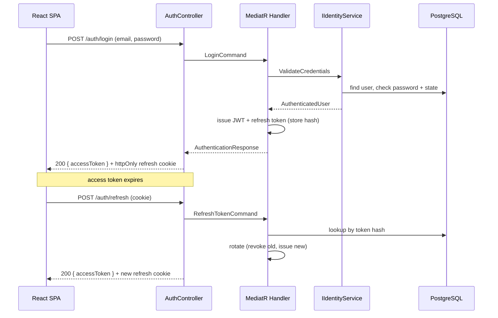

# Authentication Slice — Design

The first vertical slice implements account registration, email verification, login with JWT +
rotating refresh tokens, and session refresh. It exercises every architectural layer end-to-end.

## Data model

Only the **SHA-256 hash** of each refresh token is stored. Tokens rotate on every use; presenting an
already-rotated token is treated as theft and revokes the user's whole active token chain.

## Login + refresh flow

## Layer responsibilities

| Concern | Layer | Type |
|---|---|---|
| Password/lockout/roles | Infrastructure | `IdentityService` (behind `IIdentityService`) |
| JWT signing | Infrastructure | `JwtTokenService` |
| Token rotation policy | Application | `RefreshTokenCommandHandler`, `AuthTokenIssuer` |
| Refresh token storage | Persistence | `RefreshTokenRepository`, EF Core |
| HTTP, cookies, rate limiting | API | `AuthController`, middleware |

## Security properties

- Refresh tokens stored hashed; rotated on use; replay revokes the chain.
- Access tokens short-lived (15 min); refresh cookie is `httpOnly`.
- Login is rate-limited (10/min/IP) and increments Identity lockout counters.
- Credential errors are generic to prevent account enumeration.
- Email must be verified before first login.
